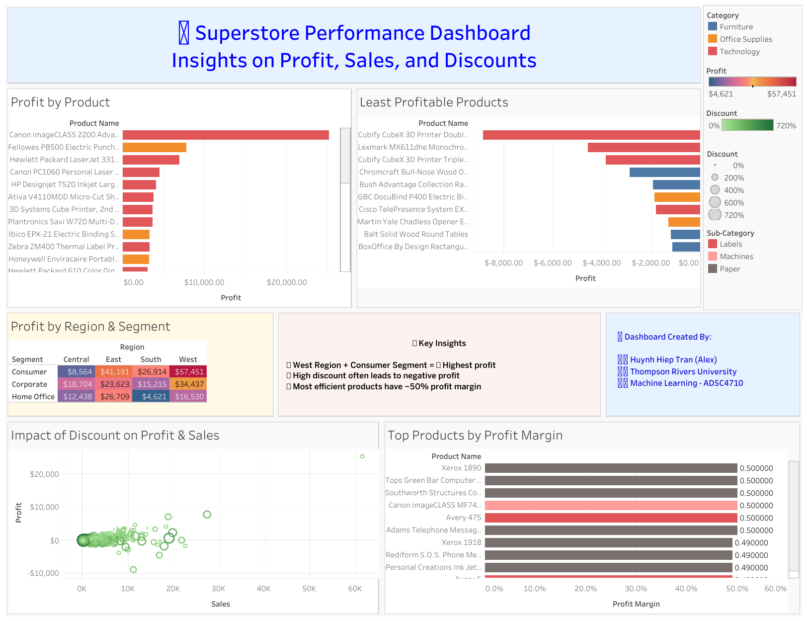

# 📊 Superstore Performance Dashboard  
### Insights on Profit, Sales, and Discounts  

---

## 🔗 Live Dashboard  
Explore the interactive version on Tableau Public:  
👉 [View Superstore Performance Dashboard](https://public.tableau.com/views/Superstore_Analysis_Huynh_Hiep_Tran_Alex/SuperstorePerformanceDashboard?:language=en-US&:sid=&:redirect=auth&:display_count=n&:origin=viz_share_link)

---

## 🧭 Project Overview  
This Tableau dashboard provides a comprehensive analysis of the **Sample Superstore dataset**, focusing on how **sales, profit, and discounts** interact across different products, regions, and customer segments.  

It helps identify:
- High-profit regions and customer segments  
- Products with strong or weak profitability  
- The relationship between discounts and profit margins  

---

## 🧮 Dataset Details  
**Dataset:** Tableau Sample Superstore  
**Records:** 9,994  
**Key Columns:** Category, Sub-Category, Region, Segment, Sales, Profit, Discount, Quantity  

**Source:** Tableau built-in sample dataset  

---

## 🔍 Key Insights  
📍 **West Region + Consumer Segment = Highest Profit**  
📍 **High Discounts often lead to Negative Profit**  
📍 **Most Efficient Products maintain ~50% Profit Margin**  
📍 **Technology Category shows highest profitability overall**  
📍 **Furniture Category has lowest profit margin despite high sales**

---

## 🖼️ Dashboard Components  
- **Profit by Product:** Highlights top and bottom-performing products.  
- **Profit by Region & Segment:** Reveals geographic and customer-based performance.  
- **Impact of Discount on Profit & Sales:** Scatter plot showing how discounts affect outcomes.  
- **Top Products by Profit Margin:** Visualizes efficiency of product categories.  
- **Key Insights Section:** Summarizes findings for quick interpretation.  

---

## 🧑‍💻 Dashboard Created By  
**Huynh Hiep Tran (Alex Tran)**  
🎓 *Thompson Rivers University — Machine Learning (ADSC4710)*  
📍 Kamloops, British Columbia, Canada  

🔗 [Tableau Public Profile](https://public.tableau.com/app/profile/alex.tran7019)  
📧 alextran21211@gmail.com  

---

## ⚙️ Technologies Used  
- Tableau Public  
- Data Visualization & Dashboard Design  
- Exploratory Data Analysis (EDA)  

---

## 🏁 Summary  
This project demonstrates my ability to design interactive Tableau dashboards that communicate key business insights clearly and effectively. It integrates analytical storytelling with clean visual design to highlight how data-driven decisions can optimize profit and reduce inefficiencies.

---

